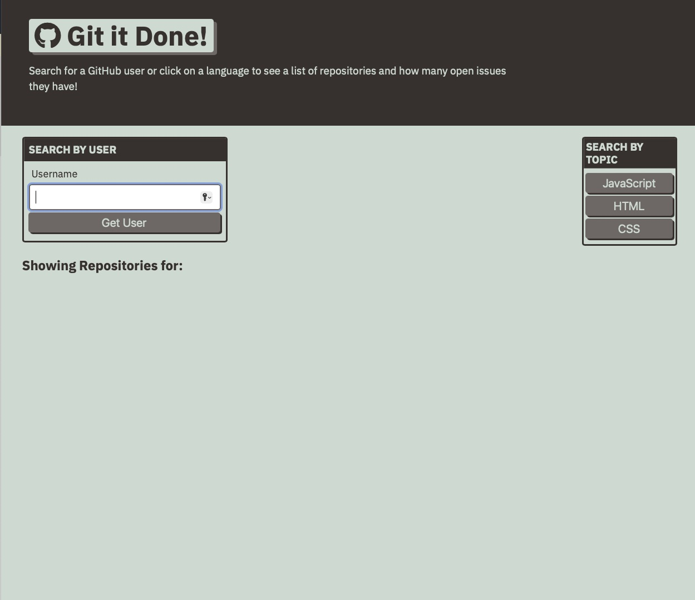

# Git It Done 

## Description 
This project is a web application that searches for open-source projects with open issues and pull requests through the GitHub API.This application utilizes the program's Get Programming interface to speak with the server.

## Installation

Clone the repository locally and double click `index.html` or click on the link below in the usage section

## Usage

Screenshot of website

To visit please click on link [link](https://vsoto7697.github.io/git-it-done/)

## License

Copyright (c) 2022 Victor Soto